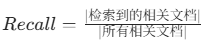
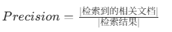
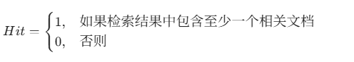
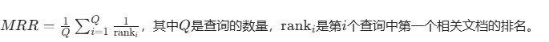

# 多模式信息检索评估

## 项目概述  
本项目构建多模式信息检索系统，融合**关键词检索**与**向量检索**能力，支持静态、动态权重融合策略。通过召回率、精确率等核心指标量化检索效果，结合可视化图表对比不同方案性能，助力高效信息检索与结果评估。  

## 核心功能  
### 1. 多模式检索  
- **关键词检索**：基于 Whoosh 引擎实现关键词匹配，快速定位含目标词的文档，适配明确词项查询场景。  
- **向量检索**：依托 OllamaEmbeddings 与 Milvus 向量库，挖掘语义关联，解决模糊、长尾查询需求。  

### 2. 融合策略  
- **静态融合**：通过 `static_alpha` 参数固定向量检索、关键词检索的权重占比，简单直接。  
- **动态融合**：依据查询“具体性”（如关键词密度、语义复杂度）自适应调整权重，贴合多样化检索意图。  

### 3. 评估体系 
#### （1）召回率（Recall）  
- **定义**：检索结果覆盖的相关文档，占“所有相关文档”的比例。  
- **公式**：  
    
- **逻辑**：召回率越高，系统“找全相关文档”能力越强；值为 1 时，无相关文档遗漏。  

#### （2）精确率（Precision）  
- **定义**：检索结果里，真正相关文档的占比。  
- **公式**：  
    
- **逻辑**：精确率越高，结果“噪声越少”；值为 1 时，所有输出均为相关文档。  

#### （3）命中数（Hit）  
- **定义**：判断检索结果是否包含**至少 1 条相关文档**。  
- **公式**：  
    
- **逻辑**：二值指标，快速验证“是否命中相关内容”，简化初步效果判断。  

#### （4）平均倒数排名（Mean Reciprocal Rank, MRR）  
- **定义**：衡量“首个相关文档”在结果中的排名（排名越前，值越高）。  
- **公式**：  
      
- **逻辑**：关注“首条相关结果的位置”，排名第 1 时 MRR=1，体现结果“首条相关性”优劣。  

#### （5）归一化折损累积增益（Normalized Discounted Cumulative Gain, NDCG）  
- **定义**：综合“相关性得分”与“排名顺序”，评估结果质量（得分越高，质量越好）。 
  - 归一化折损累积增益（NDCG）：  
      
- **逻辑**：兼顾“相关性强度”与“排序合理性”，NDCG=1 时，结果与“理想排序”完全一致，深度度量检索质量。  

### 4. 可视化分析  
通过 Matplotlib 生成柱状图，直观对比不同检索方式/融合策略的指标表现，快速定位最优方案。  


## 代码结构  
```
.
├── config/       # 配置文件（数据库、模型参数等）
│   └── config.py 
├── retrieval.py  # 检索核心逻辑（关键词、向量、融合策略）
├── evaluation.py # 评估指标计算（召回率、精确率、MRR、NDCG 等）
└── main_eval1.py # 主脚本（加载数据、执行检索+评估+可视化）
```  


## 依赖说明  
需安装以下库（建议通过 `pip` 或 `conda` 配置环境）：  
- 基础工具：`os` `json` `logging`（Python 内置）  
- 分词与检索：`jieba`（中文分词）、`whoosh`（关键词检索）  
- 向量与语义：`langchain_ollama`（OllamaEmbeddings）、`langchain`（向量存储）  
- 数据科学：`sklearn`（TF-IDF 计算）、`matplotlib`（可视化）、`numpy`（数值计算）  


## 使用流程  
1. **环境准备**：安装依赖库，确保 Milvus、Ollama 服务正常运行。  
2. **参数配置**：修改 `config/config.py`，设置数据库连接、检索阈值等参数。  
3. **执行评估**：运行 `main_eval1.py`，自动完成**数据加载→检索→指标计算→可视化输出**。  


## 贡献与反馈  
- 欢迎提交 PR 优化功能（如扩展检索模型、新增评估指标）。  
- 发现问题或需求，可在 GitHub Issues 反馈，会优先响应处理。  


## 协议说明  
项目采用 **MIT 许可证**，允许自由使用、修改、分发，需保留原版权声明。  

 
